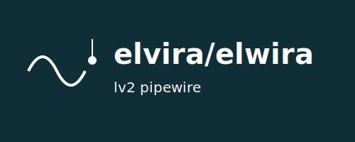
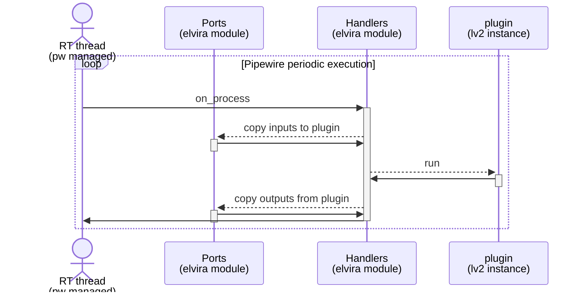
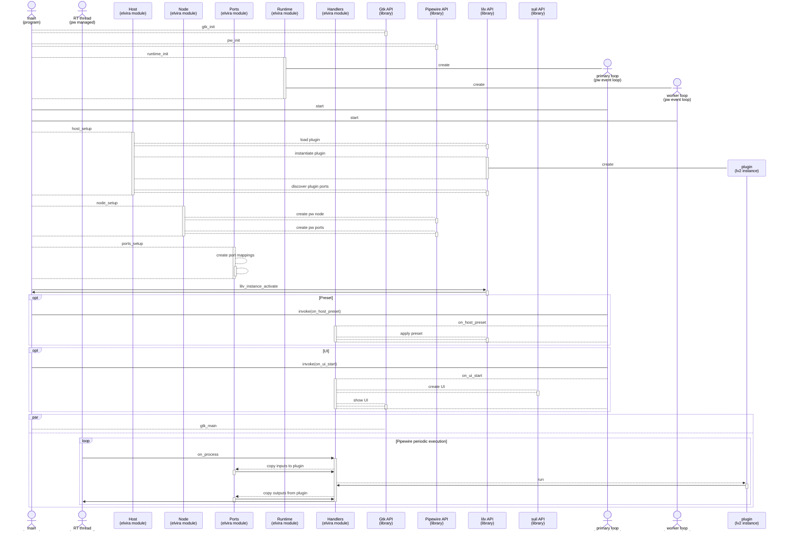

# Project
*elvira* is an lv2 host for pipewire. Unlike other lv2 hosts that is implemented using jack APIs and uses the pipewire jack "emulation", the elvira application only uses native pipewire APIs.

A lot of basic functionality is in place.
In case you are missing something vital, do not hesitate to let me know.

Pipewire is a great fit for implementing an lv2 host.
A lot of functionality required for the elvira program is provided by the pipewire client API. In addition the pipewire infrastructure provides
features that can help implement various lv2 plugin related management scenarios. 
As an example, I have created a web based management interface for elvira, that automatically discovers all elvira program instances and let you perform some basic tasks towards these instances.
This web application will soon be made available via this page.

# Building
There are very few dependencies so building on most linux systems should be pretty straight forward.
The *tools/build* script along with the CMakeLists.txt should both be rather easy to understand, but in case you have problems I can probably help.
The build script will install elvira as /usr/bin/elvira.

In the elwira folder you find a web server program that contains a simple web page to control your elvira program instances. The web server program, called elwira, is a self contained
single executable file. To build the elwira executable do (you need go development tools installed)
```console
foo@bar:~$ cd elwira
foo@bar:~$ go build

```

# Running
Running is simple since elvira is just a single executable file. As long as the elvira binary is in your PATH, just run elvira at your shell prompt:
```console
foo@bar:~$ elvira myname http://example.net/lv2/plugin/myplugin --showui

```
To run the elwira web server do
```console
foo@bar:~$ ./elwira/elwira

```
The elwira program prints the url of the elvira control page, so just open your browser on this url. 
The elwira program interacts with the pipewire and lv2 tools on your system. The following CLI programs needs to be available:
* lv2ls
* lv2info
* pw-cli
* pw-dump
* pw-metadata

In order to use elvira, pipewire must be installed on your system and then you will most likely have the required pw-* programs. The
lv2 programs are typically found in a package named lilv-utils or similar.

# LV2_PATH
The LV2_PATH environment variable control where in the filesystem various lv2 related libraries looks for resources (e.g. plugins, presets). 
For elvira to work it is important that this variable is properly set. In case it is unset, elvira will set it to a value corresponding
to the following setting:
```console
foo@bar:~$ export LV2_PATH=$HOME/.lv2:/usr/lib/lv2

```

The elvira function to save a preset of its current state, will save the preset information at $HOME/.lv2 . 
In order for the saved preset to be used, it is vital that this location is part of LV2_PATH.

# Basic terminology
An elvira program contains one single lv2 plugin instance. The elvira program calls the plugin instance and its associated resources an *lv2 host*. In addition to the *lv2 host*, the program also contains a *pipewire node*.
This node represents the required mechanisms and resources for integration into a *pipwire* infrastructure.
The *lv2 host* represents all required mechanisms and resources for creation of an lv2 plugin instance.

An *lv2 host* has ports for connecting between the internals of the plugin and the outside world. Likewise a *pipewire node* has ports to connect to its outer world. 

Pipewire ports makes it possible to connect an Engines inputs and outputs to/from other pipewire nodes. 

*elvira* performs mapping between the *lv2 host* ports and the *pipewire* node ports.

# Port mapping
One of the key aspects of hosting an lv2 host function in a pipewire environment,
is the mapping between the lv2 ports of the plugin instances and the ports of the pipewire nodes.
On some type of ports, namely *Audio ports*, this mapping is very easy to achieve,
mostly due to similar semantics and implementation strategies. 

For other ports, like the *lv2 Control ports*, there is really no correspondence to any pipewire port type.
Luckily, for many cases it is enough to manage this via a shell command, to assign values to control ports.

The *pipewire Control ports* are similar in nature to the *lv2 Atom ports*. This is especially true for carrying of *Midi* messages.

# Principle of operation

This diagram shoś the core operation of the elvira program. Assisted by the pipewire infrastructure a realtime thread cyclically calls elvira's on_process handler. The handler
copies data from pipewire input ports to the plugin's input ports. The the plugin's run method is called. When run is done, the handler copies data from the plugin's output ports to pipewire
output ports. This process is then repeated over and over again.

# Software architecture
The following diagram exposes a number of different aspects of the elvira software architecture. More detailed information is available in the code itself. A lot of the functionality of the elvira implementation comes from the used components, such as pipewire, lv2, lilv, suil, etc. The functionality of these componenents is documented elsewhere.



