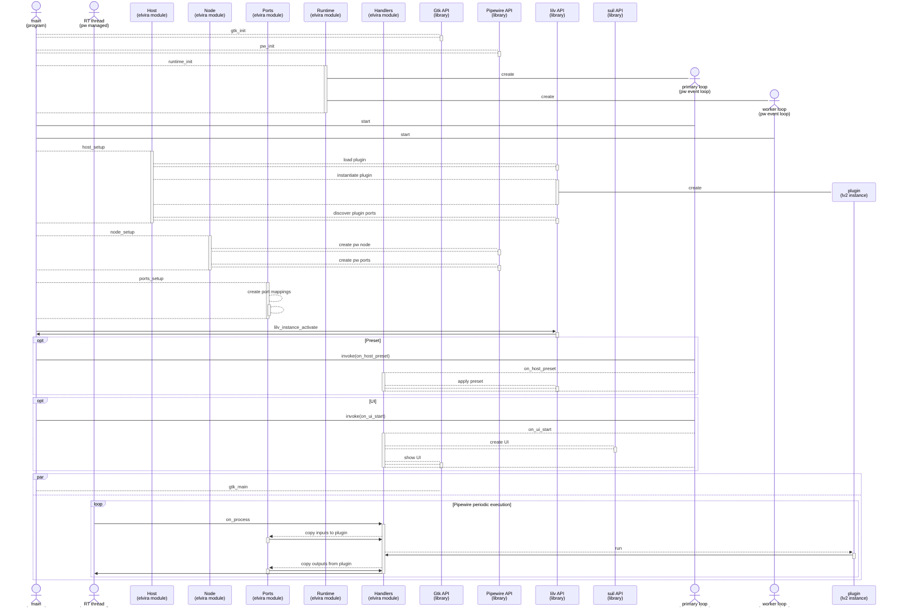
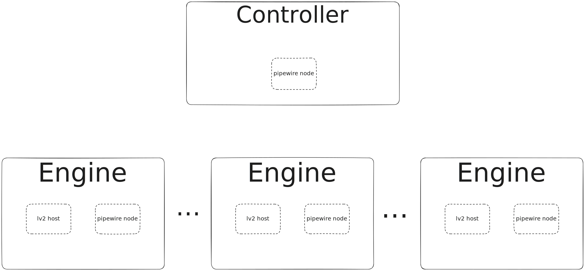

# Software architecture
The following diagram exposes a number of different aspects of the elvira software architecture. More detailed information is available in the code itself. A lot of the functionality of the elvira implementation comes from the used components, such as pipewire, lv2, lilv, suil, etc. The functionality of these componenents is documented elsewhere.

# LWira
Pronounced “elvira”, is an lv2 host for pipewire

Origin of project name: Lv2pipeWire

elvira is so much easier to write, so in the following we will use elvira;)

This is very much work in progress. A lot of basic functionality is in place. Code is ugly and will be improved. Documentation is missing, but it will be there eventually.

Pipewire is a great fit for implementing an lv2 host.

An elvira based system contains few or many lv2 plugin instances. Each of these lv2 plugin instances is called an *lv2 host*, and they are managed (created/deleted) by a *Controller*.
Each *lv2 host* is represented by an *Engine*. In addition to the *lv2 host*, the *Engine* also contains a *pipewire node*.
This node represents the required mechanisms and resources for integration into a *pipwire* infrastructure.
The *lv2 host* represents all required mechanisms and resources for creation of an lv2 plugin instance.
The *Controller* contains a similar *pipewire node*, however currently it differs from the Engines' pipewire node by *not exposing* any *pipewire ports*.
Pipewire ports makes it possible to connect an Engines inputs and outputs to/from other pipewire nodes. 

pipewire contains a CLI tool (pw-cli send-command ...) which could be used to send commands to arbitrary pipewire nodes.
Currently, this is used for a couple of different tasks in elvira:

* Request the controller to add a set of new Engines
* Request the controller to remove a set of existing engines
* Request an Engine to save its current state in a Preset
* Request an Engine to apply a previously saved Preset
* Assign a value to an lv2 input control port

The first two of these operations are targeted towards the Controller, and this is the reason for the Controller being a pipewire node.
The remaining operations are targeted towards *a specific* Engine and addressed to the Engine's pipewire node.
(Some of these commands do not exist in the currently available codebase, but they will be in the near future).

One of the key aspects of hosting an lv2 host function in a pipewire environment,
is the mapping between the lv2 ports of the plugin instances and the ports of the pipewire nodes.
On some type of ports, namely *Audio ports*, this mapping is very easy to achieve,
mostly due to similar semantics and implementation strategies. 

For other ports, like the *lv2 Control ports*, there is really no correspondence to any pipewire port type.
Luckily, for many cases it is enough to manage this via the command mention above, to assign values to control ports.

The *pipewire Control ports* are similar in nature to the *lv2 Atom ports*. This is especially true for carrying of *Midi* messages. .........

Operation
---------
Start the program using the program name *elvira*

$ elvira

This will start a program with a controller but no engines (unless you have a default config file - see below).

elvira is primarily controlled by a json formatted configuration file. In order to start elvira with a number of engines, you need to prepare
a configuration file and give the name of the path on the elvira command line:

$ elvira my_configuration.json

In case you name your configuration file elvira.json and place it in the directory where you start elvira, then it will be used in case you omitt the filename from the command line:

$ elvira

Configuration file format
-------------------------

Commands
--------
save
preset
add (same json format as in configuration files) 

